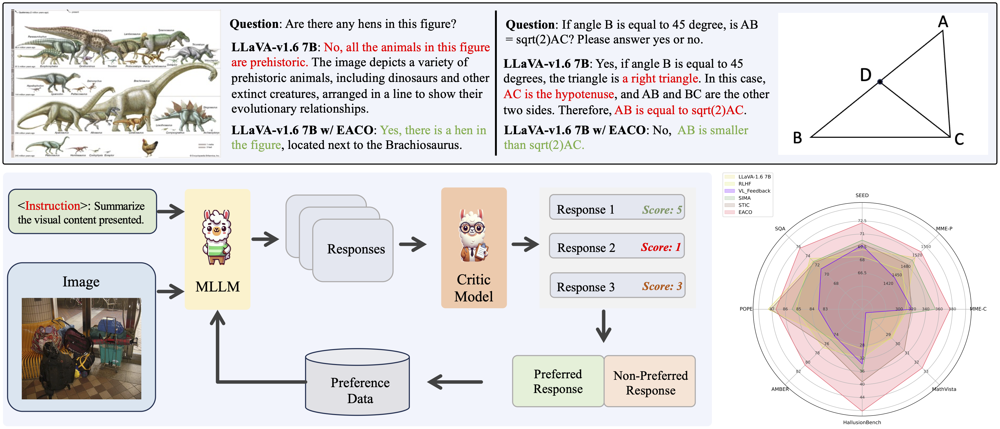

# EACO: Enhancing Alignment in Multimodal LLMs via Critical Observation

<a href='https://arxiv.org/abs/2412.04903'></a>

This is draft code for the paper, EACO: Enhancing Alignment in Multimodal LLMs via Critical Observation.

## Introduction <a name="introduction"></a>


<p align="center"> <br>  <br> </p>


## Acknowledgement <a name="acknowledgement"></a>

The codebase is built upon [LLaVA](https://github.com/haotian-liu/LLaVA). And the Critic Data is refined from [VL-Feedback](https://arxiv.org/abs/2410.09421).

## Citation <a name="citation"></a>

If you find this repo useful for your research, please consider citing the paper
```
@article{wang2024eaco,
  title={EACO: Enhancing Alignment in Multimodal LLMs via Critical Observation},
  author={Wang, Yongxin and Cao, Meng and Lin, Haokun and Han, Mingfei and Ma, Liang and Jiang, Jin and Cheng, Yuhao and Liang, Xiaodan},
  journal={arXiv preprint arXiv:2412.04903},
  year={2024}
}
```
